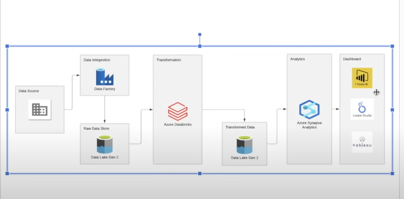
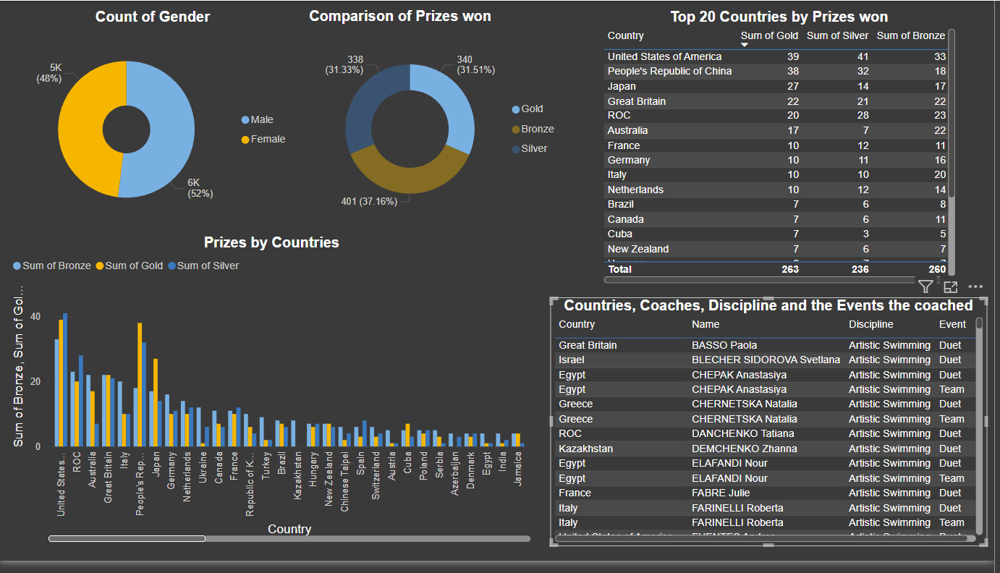

# Tokyo Olympics Data Engineering Pipeline

This project demonstrates an end-to-end data engineering pipeline for analyzing the Tokyo Olympics dataset from Kaggle. The pipeline leverages Azure services for data ingestion, transformation, storage, and visualization.

## Architecture Overview

- **Data Source:**
  - The dataset is sourced from Kaggle (Tokyo Olympics data), containing athlete, event, medal, and country information.

- **Data Ingestion:**
  - Azure Data Factory (ADF) is used to ingest raw data from Kaggle into Azure Data Lake Gen 2.

- **Raw Data Storage:**
  - Data is stored in Azure Data Lake Gen 2 for further processing.

- **Data Transformation:**
  - Azure Databricks is utilized for data cleaning, transformation, and structuring using PySpark. Tasks include handling missing values, aggregating statistics, and preparing the data for analytics.

- **Transformed Data Storage:**
  - Processed data is stored back in Azure Data Lake Gen 2.

- **Analytics:**
  - Azure Synapse Analytics is used for running SQL queries and performing analytics on the transformed data.

- **Visualization:**
  - Power BI dashboards visualize the insights from the Olympics data, including:
    - Medal counts by country
    - Athlete performance trends
    - Event statistics and comparisons
   
  

## Tools & Technologies

- **Azure Data Factory:** For data ingestion.
- **Azure Data Lake Gen 2:** For raw and transformed data storage.
- **Azure Databricks (with PySpark):** For data transformation.
- **Azure Synapse Analytics:** For analytics.
- **Power BI:** For data visualization.

## How to Run

1. Set up Azure resources (Data Factory, Data Lake, Databricks, Synapse Analytics).
2. Ingest the Tokyo Olympics dataset from Kaggle using Data Factory.
3. Process the data using PySpark in Databricks.
4. Run analytics queries in Synapse Analytics.
5. Visualize the insights using Power BI dashboards.

## Dataset

- **Source:** Tokyo Olympics Data on Kaggle
